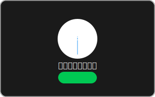

# Nezu Mod Collection

  
  
  <h1>Windows体験をより快適にするMOD's</h1>
  <h3>モダンで美しいデザインのWindows拡張コレクション</h3>

  <table>
    <tr>
      <td align="center">
        
      </td>
      <td align="center">
        
      </td>
      <td align="center">
        
      </td>
    </tr>
  </table>

   

  <table>
    <tr>
      <td align="center">
        
      </td>
      <td align="center">
        
      </td>
      <td align="center">
        
      </td>
      <td align="center">
        
      </td>
    </tr>
  </table>

 
 

  <h2>✨ 機能</h2>
  

 
 

  <h2>📥 インストール</h2>

  <table>
    <tr>
      <td>
        <h3>🔧 セットアップ手順</h3>
        <ol align="left">
          <li><a href="https://github.com/ramensoftware/windhawk">Windhawk</a>をインストール</li>
          <li>Windhawkを起動</li>
          <li>「新しいModを作成」を選択</li>
          <li>Modのソースコードをコピー</li>
          <li>Windhawkエディタに貼り付け</li>
          <li>「Compile Mod」をクリック</li>
          <li>「Enable Mod」をクリック</li>
        </ol>
      </td>
    </tr>
  </table>

   

  <table>
    <tr>
      <td>
        <h3>⚠️ 注意事項</h3>
        <ul align="left">
          <li>Windows 11での動作を前提に開発しています。Windows 10以前のOSでの動作は未確認のため、自己責任でご利用ください</li>
          <li>無効化する場合は、Modのトグルをオフにしてください</li>
          <li>一部の機能ではシステムの再起動が必要な場合があります</li>
        </ul>
      </td>
    </tr>
  </table>

 
 

  <h2>🛠️ 開発</h2>

  

   
   

  <h3>📋 開発基準</h3>

  <table>
    <tr>
      <td align="center" width="33%">
        <h4>🎯 コード品質</h4>
        <ul align="left">
          <li>クリーンで保守性の高いコード作成</li>
          <li>詳細ドキュメント整備</li>
          <li>堅牢なエラー処理の実装</li>
        </ul>
      </td>
      <td align="center" width="33%">
        <h4>🏗️ アーキテクチャ</h4>
        <ul align="left">
          <li>モジュール化された設計</li>
          <li>再利用可能なコンポーネント</li>
          <li>パフォーマンスの最適化</li>
        </ul>
      </td>
      <td align="center" width="33%">
        <h4>🔒 セキュリティ</h4>
        <ul align="left">
          <li>安全なAPI使用</li>
          <li>適切なメモリ管理</li>
          <li>包括的なエラー対策</li>
        </ul>
      </td>
    </tr>
  </table>

 
 

  <h2>🤝 コミュニティ</h2>

  <table>
    <tr>
      <td align="center">
        
      </td>
      <td align="center">
        
      </td>
      <td align="center">
        
      </td>
    </tr>
  </table>

 
 

  <h2>📄 ライセンス</h2>

  

 
 

  Created with ❤️ by <a href="https://github.com/nezumi0627">nezumi0627</a>

 