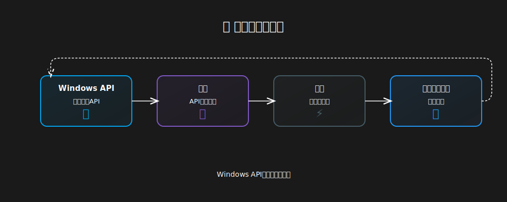

# Nezu Mod Collection

  
  
  <h3>
    Windows体験をより快適にするカスタマイズツール
  </h3>
  

    モダンで美しいデザインのWindows拡張コレクション
  

  

    
    
    
  

  

    
    
    
    
  

## ✨ 機能

  

    <a href="docs/taskbar-clock.md" style="text-decoration: none; color: inherit;">
      

        
      

      <h3 style="margin: 0 0 8px 0; color: #fff;">タスクバーの時計</h3>
      

        
      

      

        スタイリッシュな時計���日付表示を実現。 
        Windowsに自然に溶け込むモダンなデザイン。
      

    </a>
  

## 📥 インストール

  <!-- シットアップ手順 -->
  

    <h3 style="margin: 0 0 16px 0; color: #fff;">🔧 セットアップ手順</h3>
    

      <ol style="margin: 0; padding-left: 24px;">
        <li style="margin-bottom: 12px;">
          <a href="https://github.com/ramensoftware/windhawk" style="color: #00a2ed; text-decoration: none;">Windhawk</a>をインストール
        </li>
        <li style="margin-bottom: 12px;">Windhawkを起動</li>
        <li style="margin-bottom: 12px;">「新しいModを作成」を選択</li>
        <li style="margin-bottom: 12px;">Modのソースコードをコピー</li>
        <li style="margin-bottom: 12px;">Windhawkエディタに貼り付け</li>
        <li style="margin-bottom: 12px;">「Compile Mod」をクリック</li>
        <li style="margin-bottom: 12px;">「Enable Mod」をクリック</li>
      </ol>
    

  

  <!-- 注意事項 -->
  

    <h3 style="margin: 0 0 16px 0; color: #fff;">⚠️ 注意事項</h3>
    <ul style="text-align: left; color: #ffffffcc; margin: 0; padding-left: 24px;">
      <li style="margin-bottom: 8px;">Windows 11での動作を前提に開発しています。Windows 10以前のOSでの動作は未確認のため、自己責任でご利用ください</li>
      <li style="margin-bottom: 8px;">無効化する場合は、Modのトグルをオフにしてください</li>
      <li style="margin-bottom: 8px;">一部の機能ではシステムの再起動が必要な場合があります</li>
    </ul>
  

## 🛠️ 開発

  <!-- アーキテクチャ -->
  

    <h3 style="margin: 0 0 16px 0; color: #fff;">🏗️ アーキテクチャ</h3>
    
  

  <!-- 開発基準 -->
  

    <h3 style="margin: 0 0 24px 0; color: #fff;">📋 開発基準</h3>
    

      <!-- コード品質 -->
      

        <h4 style="margin: 0 0 16px 0; color: #fff;">
          🎯
          コード品質
        </h4>
        <ul style="color: #ffffffcc; margin: 0; padding-left: 20px; list-style-type: '→ ';">
          <li style="margin-bottom: 8px;">クリーンで保守性の高いコード作成</li>
          <li style="margin-bottom: 8px;">詳細ドキュメント整備</li>
          <li style="margin-bottom: 8px;">堅牢なエラー処理の実装</li>
        </ul>
      

      <!-- アーキテクチャ -->
      

        <h4 style="margin: 0 0 16px 0; color: #fff;">
          🏗️
          アーキテクチャ
        </h4>
        <ul style="color: #ffffffcc; margin: 0; padding-left: 20px; list-style-type: '→ ';">
          <li style="margin-bottom: 8px;">モジュール化された設計</li>
          <li style="margin-bottom: 8px;">再利用可能なコンポーネント</li>
          <li style="margin-bottom: 8px;">パフォーマンスの最適化</li>
        </ul>
      

      <!-- セキュリティ -->
      

        <h4 style="margin: 0 0 16px 0; color: #fff;">
          🔒
          セキュリティ
        </h4>
        <ul style="color: #ffffffcc; margin: 0; padding-left: 20px; list-style-type: '→ ';">
          <li style="margin-bottom: 8px;">安全なAPI使用</li>
          <li style="margin-bottom: 8px;">適切なメモリ管理</li>
          <li style="margin-bottom: 8px;">包括的なエラー対策</li>
        </ul>
      

    

  

## 🤝 コミュニティ

  
  
  

## 📄 ライセンス

  

---

  

    Created with ❤️ by <a href="https://github.com/nezumi0627">nezumi0627</a>
  

 